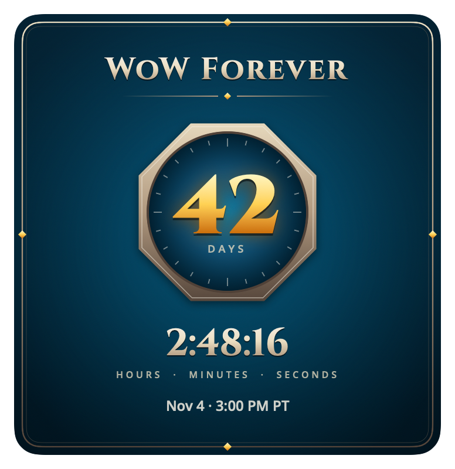
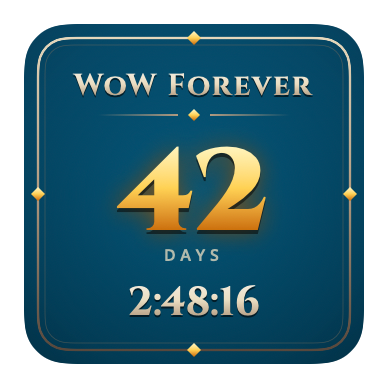
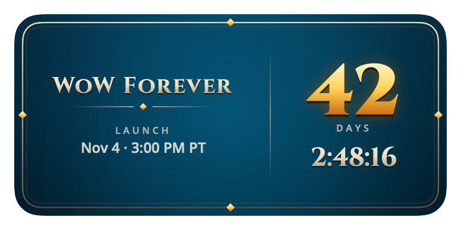

# WoW Forever Countdown

A native macOS desktop widget and menu bar app that counts down to the **World of Warcraft: Forever** launch on **November 4, 2026 at 3:00 PM PT** (23:00 UTC). When the countdown ends, it celebrates with full-screen fireworks and a fanfare.

<p align="center">
  
</p>
<p align="center">
  
  &nbsp;
  
</p>

> Unofficial fan project. Not affiliated with or endorsed by Blizzard Entertainment. World of Warcraft is a trademark of Blizzard Entertainment, Inc.

## Features

- **A real desktop widget** in Small, Medium and Large. Add it from the widget gallery and place it like any other widget. The day count updates once a day, and hours, minutes and seconds tick live.
- **A menu bar countdown** next to an hourglass icon, ticking every second, for example `42d 06:13:02`.
- **Launch celebration**: click-through fireworks on every screen, a gold "WoW Forever is now live" banner, and a synthesized brass fanfare.
- **Silent milestone notifications** at 30, 14, 7, 3 and 1 days, then 12 hours, 1 hour, 10 minutes, and at launch.
- **Launch at login**, managed through macOS Login Items.
- **Design** based on the WoW Forever site: its teal, bronze and gold palette, carved serif capitals, and a bronze medallion.

## Requirements

- macOS 14 Sonoma or later.
- Apple Silicon for the default build. Intel is supported with `./build.sh --universal`.
- To build from source:
  - Xcode 16 or later. Development used Xcode 27.
  - [XcodeGen](https://github.com/yonaskolb/XcodeGen): `brew install xcodegen`.
  - An Apple ID signed in to Xcode (Xcode → Settings → Accounts). A free Personal Team is enough to run the app on your own Mac.

## Build and install

```sh
git clone https://github.com/ksarantakos/countdown.git
cd countdown

# One-time: set your signing team. This file is gitignored.
echo 'DEVELOPMENT_TEAM = ABCDE12345' > Config/Local.xcconfig

./build.sh
open ~/Applications/WoWCountdown.app
```

To find your team ID, look in Xcode → Settings → Accounts, or run:

```sh
plutil -p ~/Library/Preferences/com.apple.dt.Xcode.plist | grep -E 'teamID|teamName'
```

`build.sh` generates the Xcode project, builds a Release app with its widget extension, verifies the signature, and writes `dist/WoWCountdown.app` and `dist/WoWCountdown.app.zip`. It then installs to `~/Applications`. If the app is running, it quits it first, and it stops the old widget extension so the new one loads. Reopen the app afterwards.

| Flag | Effect |
|---|---|
| `--universal` | Builds arm64 and x86_64. Fails if either architecture is missing. |
| `--adhoc` | Signs ad-hoc with no team, for local experiments only. |
| `--no-install` | Builds into `dist/` without installing. |

If `xcode-select` points at the Command Line Tools, `build.sh` uses `/Applications/Xcode.app` and says so. To make Xcode the default, run `sudo xcode-select -s /Applications/Xcode.app`.

## Using it

### Add the widget

1. Right-click an empty area of the desktop and choose **Edit Widgets…**.
2. Search for **WoW Forever** and drag a size onto the desktop.

The menu bar's **Add the Widget to Your Desktop…** item shows the same steps.

When windows cover the desktop, macOS shows widgets in a dimmed monochrome style, and the widget switches to an engraved outline look. To keep full color all the time, set **System Settings → Desktop & Dock → Widget style → Full-color**.

### Menu bar

The hourglass item shows the countdown. Its menu has:

- **Add the Widget to Your Desktop…**: the steps above.
- **Preview Celebration**: plays the fireworks and fanfare now. It doesn't affect the countdown or the real launch celebration.
- **Launch at Login**: the checkmark reflects the system's Login Items setting. If macOS needs your approval, this item reads **Approve in System Settings…** instead.
- **Milestone Notifications**: shows how many are scheduled. If notifications are off, it becomes a shortcut to System Settings.

### The launch celebration

The celebration plays **once at launch, with catch-up within six hours; also available through Preview Celebration.**

- If the app is running at 3:00 PM PT, it celebrates right away.
- If your Mac was asleep or the app wasn't running, it celebrates when it next wakes or starts, as long as that's within six hours of launch. After that, it just shows **NOW LIVE**.
- It never celebrates twice. A flag keyed to the launch time is saved before the effects start.
- With **Reduce Motion** on, the fireworks are replaced by a soft glow.

The notifications are silent. The fanfare is the only sound the app makes.

### Demo mode

To try the countdown's final seconds and the celebration without waiting until November:

```sh
osascript -e 'quit app id "com.ksarantakos.wowcountdown"'
open ~/Applications/WoWCountdown.app --args --demo-seconds 10
```

Demo mode counts down to 10 seconds from now and shows **DEMO** in the menu bar. All of its state stays in memory. It doesn't change the real launch flag, doesn't schedule notifications, and doesn't touch Launch at Login. The desktop widget always shows the real launch date.

## Installing a downloaded build

Release builds are signed with a free Personal Team, not notarized, so macOS blocks them on first open. To allow it:

1. Unzip `WoWCountdown.app.zip` and move `WoWCountdown.app` to Applications.
2. Open it once. macOS will refuse.
3. Go to **System Settings → Privacy & Security** and click **Open Anyway** next to the WoWCountdown message.

## Development

```sh
swift test                 # CountdownCore unit tests (Swift Testing)
xcodegen generate          # regenerate WoWCountdown.xcodeproj (gitignored) from project.yml
open WoWCountdown.xcodeproj
```

The tests use Swift Testing, which ships with Xcode but not with the Command Line Tools. If `xcode-select -p` prints a `CommandLineTools` path, `swift test` fails with `no such module 'Testing'`. In that case, run it against Xcode:

```sh
DEVELOPER_DIR=/Applications/Xcode.app/Contents/Developer swift test
```

The countdown logic lives in `CountdownCore`, a SwiftPM library with no AppKit dependency, and is fully unit-tested. It covers:

- the DST-correct target time;
- rounding, which rounds up so the display never shows 00:00:00 before launch;
- the celebration policy;
- the widget's day-boundary timeline;
- milestone notification reconciliation;
- demo-mode isolation.

To watch the app's logs:

```sh
log stream --predicate 'subsystem == "com.ksarantakos.wowcountdown"' --level info
```

To regenerate the app icon from a new source image:

```sh
./scripts/convert-assets.sh path/to/icon.avif
```

### Project layout

```
project.yml                  XcodeGen spec: the app plus the embedded widget extension
Package.swift                CountdownCore library and tests
Config/Signing.xcconfig      signing settings; includes the gitignored Local.xcconfig
Sources/
  CountdownCore/             countdown math, celebration policy, widget timeline, milestones
  WoWCountdown/              menu bar app: clock, celebration, fanfare, notifications, login item
  WoWCountdownWidget/        WidgetKit extension: timeline provider and layouts
  Shared/                    theme (palette, fonts, ornaments) and bundled fonts
Tests/CountdownCoreTests/
scripts/convert-assets.sh    AVIF → app icon set and menu icon
build.sh                     build, verify, package and install
docs/PLAN.md                 the design plan and how it evolved
```

## Troubleshooting

- **The widget still shows an old design after rebuilding.** macOS can keep the previous widget extension running. `build.sh` stops it for you. After a manual build, run `pkill -x WoWCountdownWidget`.
- **No milestone notifications.** Enable **Allow Notifications** for WoW Forever Countdown in System Settings → Notifications, then open the app's menu once so it reschedules.
- **"No signing team configured".** Create `Config/Local.xcconfig` as shown in [Build and install](#build-and-install), or use `--adhoc` for a local-only build.

## Credits

- Design inspired by the [World of Warcraft: Forever](https://worldofwarcraft.blizzard.com/en-us/forever) site. No Blizzard artwork or fonts are included.
- [Cinzel](https://github.com/googlefonts/cinzel) by Natanael Gama and [Open Sans](https://github.com/googlefonts/opensans), both under the SIL Open Font License (see `Sources/Shared/Fonts/`).
- Code under the [MIT License](LICENSE).
